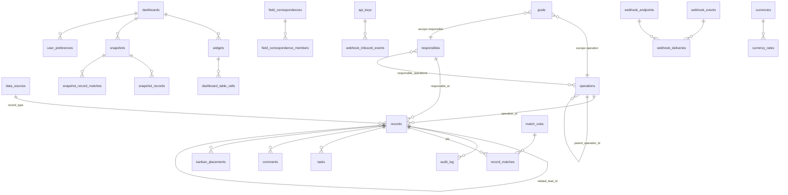

<!-- Versão: 2.0 | Data: 23/07/2026 -->
<!-- v2.0 (23/07/2026): 0088–0094 — acesso por pessoa aos boards
     (board_access + helpers auth_board_*), MULTI-ORGANIZAÇÃO (organizations/
     organization_members/app_owner com triggers de proteção via GUC;
     organization_id nas tabelas-raiz com default Zapper + triggers de stamp;
     RLS org-scoped em tudo; unicidades por-org), papéis org_admin/Owner,
     provisionamento (seed_org_defaults/delete_organization) e overrides
     individuais (user_access_overrides + deny de bases). -->

<!-- v1.9 (22/07/2026): 0086 — colunas núcleo como linhas core de
     field_definitions (overrides p/ a aba Campos; pipeline selecao com options
     dos funis, reescritas no sync). -->
<!-- v1.8 (21/07/2026): 0085 — RPCs de widget no dia de BRASÍLIA (par completo
     recriado; novo helper `_widget_local_ts` com 2 overloads;
     `_widget_col_date_expr`/`_widget_unified_expr` recriados;
     `_widget_safe_ts` vira legado). -->
<!-- v1.7 (20/07/2026): 0084 (só dados) — `custom_fields.fonte` nos mocks
     Inbound p/ satisfazer o predicado da sub `sqls`. -->
<!-- v1.6 (20/07/2026): `operations.filter` (0083 — perfil da operação) + nota
     da coluna derivada records.operation_id e do backfill
     (supabase/apply/backfill-operation-id.sql). -->
<!-- v1.5 (20/07/2026): dias não úteis (`non_working_days`, 0081), campo de
     período `custom:` em sub-fontes (0082), metas por métrica arbitrária
     (registry em sync_config 'goal_metrics'). -->
<!-- v1.4 (19/07/2026): fuso da fonte — `data_sources.timezone` (0079) e backfill
     dos datetimes do Bitrix p/ Brasília (0080). -->
<!-- v1.3 (19/07/2026): sub-fontes (0078) — tabela `sub_sources` (fonte derivada
     de uma pai, filtrada) e `field_correspondence_members.source_key` (membro de
     campo unificado passa a ser identificado pela source-key, não pelo
     record_type). -->
<!-- v1.2 (19/07/2026): record_matches_match_perf (0077) — índices compostos. -->

# Banco de dados — schema consolidado

Referência do estado **atual** do banco (após a migração 0094), para que um
mantenedor não precise ler as migrações em ordem para reconstruir o modelo.
Complementa o runbook de aplicação em [`../supabase/README.md`](../supabase/README.md)
e a visão de fluxos em [`arquitetura.md`](./arquitetura.md).

> Ao alterar o schema, atualize este documento na mesma entrega — ele só é útil
> enquanto refletir o banco real.

## 1. Como o banco é gerido

- **Aplicação manual** no SQL Editor do Supabase; o código do app nunca conecta ao
  banco em build. Não há `supabase migration` automatizado nem CI.
- Migrações em `supabase/migrations/`, todas **idempotentes**. Blocos consolidados
  por fase em `supabase/apply/fase-*.sql` (também idempotentes) + scripts de
  agendamento `pg-cron-*.sql` e o `undo-mock-reuniao.sql`.
- **Anomalias de numeração** (não "corrija" — a ordem de aplicação real é a dos
  blocos `apply/fase-*.sql` e do runbook, não estritamente o número):
  - `0014` **não existe** (número pulado);
  - `0017` tem **dois arquivos** (`0017_dynamic_columns_and_formulas.sql` e
    `0017_widget_filter_type.sql`);
  - `0049` tem **dois arquivos** (`0049_field_percent.sql` e
    `0049_widget_rpc_count_nonempty.sql`).
- Extensões usadas: `pg_cron` e `pg_net` (agendamento), além das padrões do Supabase.

## 2. Visão geral do modelo

Papéis/permissões (`roles`, `permissions`, `role_permissions`, `user_roles`) ligam-se
a `auth.users` do Supabase, assim como `responsibles.user_id` (o vínculo que governa a
visibilidade — ver §6).

## 3. Tabelas por domínio

A coluna "Origem" indica a migração que criou a tabela; colunas adicionadas depois
citam a migração entre parênteses.

### 3.1 Núcleo de dados

**`records`** (0004) — fonte de verdade da UI. Um registro = um lead, negócio, venda
do site ou linha de fonte dinâmica.

| Coluna | Notas |
|---|---|
| `id` uuid PK | |
| `record_type` text | FK → `data_sources.record_type` desde 0060 (antes CHECK fixo `lead/negocio/venda_site`) |
| `source_system` text | `bitrix`, `sheet_site`, `manual`, `csv`... (CHECK vira regex na 0060) |
| `source_id` text | ID na origem; único por `(source_system, source_id)` |
| `owner_user_id` uuid | **LEGADO** — não usar para autorização (0037) |
| `title`, `pipeline`, `stage`, `stage_semantic`, `temperature` | `stage_semantic`: open/won/lose; `temperature` é campo local, nunca sincronizado |
| `value`, `mrr` numeric, `currency` text | |
| `sale_type`, `channel` text | |
| `closed` bool, `closed_at`, `opened_at` | |
| `source_created_at`, `source_modified_at` | DATE_CREATE/DATE_MODIFY na origem; `source_created_at` é o sort/período padrão (índices na 0069) |
| `custom_fields` jsonb | Todos os campos dinâmicos, inclusive calculados materializados |
| `field_modified_at` jsonb | `{campo: timestamp}` das edições manuais — protege do sync (conflito por campo) |
| `created_at`, `updated_at`, `last_synced_at`, `locally_modified_at` | |
| `responsible_id`, `operation_id`, `related_lead_id` uuid, `lead_time_days` numeric | (0012) |
| `is_mock` bool | (0051) — mocks de Data Reunião; ver invariantes em `arquitetura.md` §5. Mocks Inbound carregam `custom_fields.fonte = "Formulário de CRM"` (0084 — predicados de sub-fonte valem em AND p/ mocks); Outbound (0053) ficam sem fonte de propósito |

**`data_sources`** (0060) — catálogo de fontes (dinâmicas, criáveis via UI).
`key` PK (regex `^[a-z][a-z0-9_]{1,39}$`), `record_type` unique (fontes novas:
key === record_type), `label`, `short_label`, `default_period_field` (CHECK entre as
colunas de data do núcleo), `builtin`, `manual_entry` (0061 — aceita criação manual;
builtins nascem desligados), `timezone` (0079 — fuso IANA da ORIGEM; datetimes
ingeridos normalizam p/ Brasília na entrada, `lib/date/normalize.ts`; NULL = sem
conversão; seed `Europe/Moscow` em `leads`/`deals`). Seed dos 3 builtins:
`leads/lead`, `deals/negocio` (período `closed_at`), `estudo/venda_site`.

**`sub_sources`** (0078) — catálogo de **sub-fontes**: uma fonte derivada de uma
pai, com as linhas da pai recortadas por um predicado. `key` PK (regex, como
`data_sources`), `parent_key` FK → `data_sources.key` (on delete cascade), `label`,
`short_label`, `default_period_field` (CHECK: colunas de data do núcleo OU, desde
a 0082, um campo personalizado de data `custom:<field_key>` — ex.: sub "SQLs"
datada pela Data Reunião; a action valida que o campo existe e é de data),
`filter` jsonb (`WidgetFilter[]` — o recorte). A sub COMPARTILHA o `record_type` da
pai (por isso mora em tabela separada, para não quebrar `data_sources.record_type
unique`/FK de `records`). Resolvida no ENGINE (perna por source-key); NÃO toca nas
RPCs de widget. O loader (`lib/config/sources.ts`) une `data_sources` + `sub_sources`
num único `SourceDef[]`.

**`field_definitions`** (0005) — metadados das colunas dinâmicas.
`field_key` unique, `label`, `data_type` (`texto|numero|data|selecao|moeda` +
`calculado`/`calculado_agg` via 0017/0045), `options`, `visible_to_roles`,
`editable_by_roles`, `is_local`, `sort_order`. Adicionadas:
`source_system`/`source_field_id`/`show_in_builder`/`formula` (0017),
`applies_to` text[] (0018), `write_back` (0031), `currency_code`/`currency_mode`
(0036; `inherit` na 0046), `allow_negative` (0044), `show_as_percent` (0049).
Leitura liberada a autenticados desde 0043 (só metadados de schema).
**Linhas core (0086):** as colunas do núcleo de `records` são seedadas como
linhas `source_system='core'` (`field_key` = nome da coluna,
`applies_to='{}'` = todas as bases, `source_field_id` NULL) — são OVERRIDES
de exibição (rótulo/olho/ordem; texto↔selecao na whitelist) das colunas
hardcoded, nunca campos de `custom_fields` (invariante 13 da arquitetura;
split em `lib/records/core-defs.ts`). `pipeline` nasce `selecao` com os funis
como `options`, reescritas a cada sync (`syncFieldCatalog` →
`lookups.categoryNames()`). O seed é idempotente (`on conflict do nothing`) e
a migração deve rodar DEPOIS do deploy do código que a acompanha.

**`field_correspondences`** + **`field_correspondence_members`** (0019) — campos
unificados globais: uma correspondência (`key` unique, `label`, `data_type`) liga no
máximo um `field_ref` por **source-key** (coluna do núcleo ou `custom:<key>`). O RPC
consome como `unified:<key>` (coalesce). `record_type` (FK → `data_sources`, 0060) +
`source_key` (0078 — pai OU sub); unicidade em `(correspondence_id, source_key)`, o
que permite N membros por `record_type` (um por source-key — ex.: `leads` e
`leads_clientes_lite` mapeando datas diferentes). Membros antigos: `source_key`
retro-preenchido com a fonte cujo `record_type` casa (a própria pai).

**`entity_custom_values`** (0033) — valores de campos dinâmicos anexados a
responsável/operação (não a um registro): `(entity_type, entity_id, field_key)` unique.

**`audit_log`** (0006) — toda edição de valor: `record_id`, `user_id` (null quando
via sync), `field`, `old_value`/`new_value` jsonb, `origin`
(`app|sync_bitrix|sync_sheet` + `api` desde 0074).

**`reuniao_freeze_backup`** (0051) — valores originais de Data Reunião zerados pela
Fase 12 (usado pelo `undo-mock-reuniao.sql`).

### 3.2 Pessoas e acesso

**`organizations`** (0089) — MULTI-ORG: uma linha por empresa/tenant. `name`
(empresa, ex. "Zapper") e `app_name` (nome do sistema, ex. "Dashboard
Comercial") são o BRANDING editável do sidebar (Configurações → Organização).
A Zapper vive no uuid FIXO `00000000-0000-4000-a000-000000000001` (default
das colunas `organization_id` da 0090). DELETE só via `delete_organization`
(trigger `enforce_organizations_guard` + GUC).

**`organization_members`** (0089) — vínculo usuário↔org; `is_org_admin`
marca o **Administrador de Organização** — ÚNICO por org (índice parcial
`organization_members_single_admin`) e indeletável/indemovível (trigger
`enforce_org_admin_guard`; o desbloqueio é o GUC transaction-local
`app.allow_protected_change='on'`, só via SQL direto — vale até p/ service
role, inclusive no cascade de excluir a conta). Escrita SÓ service role.

**`app_owner`** (0089) — o **Owner** do sistema (1 linha; seed
bruno@zapper.to). Imutável por qualquer caminho de app (trigger
`enforce_app_owner_guard`); FK a auth.users SEM cascade (excluir a conta
falha). O modo Owner (`/owner`) exige também env `OWNER_USER_ID` == uid
(guard fail-closed em `lib/auth/owner.ts`).

**`board_access`** (0088) — acesso por PESSOA a um dashboard/kanban:
`(dashboard_id, user_id)` PK + `level` (`view|edit|blocked`). Override vence
o papel (`blocked` revoga o que `visible_to_roles` daria; `view`/`edit`
concedem além); dono/admin nunca bloqueáveis. Resolução nos helpers
`auth_board_visible`/`auth_board_editable`/`auth_board_manageable`
(recriados na 0091 com o gate de org embutido).

**`user_access_overrides`** (0094) — overrides individuais fora dos boards:
`(organization_id, user_id, resource_type, resource_key)` PK, `effect`
(`allow|deny`). `settings_area` (slug da aba de Configurações): deny esconde,
allow concede além do papel (escrita segue o papel). `source` (key de
base/sub-base): deny esconde dos pickers (RLS de `data_sources`/`sub_sources`)
e dos DADOS (`records_select` exclui o record_type — helpers
`auth_denied_source_keys`/`auth_denied_record_types`).

**`roles`**, **`permissions`**, **`role_permissions`**, **`user_roles`** (0002 + seeds
0010) — papéis `admin`/`gestor`/`vendedor` e permissões (`view_all_records`,
`edit_record_values`, `manage_field_definitions`, `view_forecast`, ...).
Desde a 0092, a gestão de `user_roles` é confinada à própria org
(`auth_org_member_ids`) e o papel `admin` só é concedido/removido por
org_admin (`auth_can_grant_admin`). org_admin/Owner NÃO são linhas de
`roles` (rótulos em `SPECIAL_ROLE_LABELS`, `lib/auth/roles.ts`).

**`responsibles`** (0012) — lista curada de responsáveis. `display_name`,
`bitrix_user_id` unique (ASSIGNED_BY_ID, para o matching do sync), `user_id` →
`auth.users` (**o vínculo que dá visibilidade RLS ao vendedor**), `active`.

**`operations`** (0012) — operações comerciais; `parent_operation_id` (0016) permite
aninhamento (subárvore via função `operation_subtree`); `filter` jsonb (0083) —
FILTROS DE PERFIL (WidgetFilter[], com fonte-alvo opcional por condição) que
definem o recorte de dados da operação, editados em Configurações → Operações.

**`responsible_operations`** (0012) — N:N com `priority` (1 = operação primária).

> **`records.operation_id` é DERIVADA** (operação priority=1 do responsável no
> momento do sync; updates só preenchem quando NULL). O filtro de Operação da
> visualização NÃO usa a coluna (resolve vínculo+perfil no server —
> `lib/config/operation-scope.ts`); dimensões e restrições de snapshot usam —
> rode `supabase/apply/backfill-operation-id.sql` após mexer nos vínculos.

**`bitrix_user_map`** (0007) — mapeia usuário Bitrix → `auth.users`.

**`user_preferences`** (0024) — por usuário × dashboard (ex.: último período usado).
**`user_settings`** (0027) — jsonb livre por usuário (layout/aparência).

### 3.3 Dashboards e visualização

**`dashboards`** (0008) — `name`, `owner_user_id`, `visible_to_roles` text[],
`is_shared`, `settings` jsonb (0017 — barra de período etc.), `kind`
(`dashboard|kanban`, 0062), `status` (`active|archived|trashed`, 0087) +
`archived_at`/`trashed_at`. Ciclo de vida do hub: `archived` sai da tela
principal mas segue abrindo; `trashed` (Lixeira) NÃO abre (404 nas rotas e no
viewer público) e é purgado após 14 dias (`apply/pg-cron-purge-trash.sql` —
o hub esconde vencidos mesmo sem o cron). Sem RLS nova: transições via
`dashboards_update`, exclusão definitiva via `dashboards_delete`.

**`widgets`** (0008) — config declarativa: `dashboard_id`, `title`, `visual_type`,
`source`, `dimensions`/`metrics`/`filters` jsonb, `grid_position` jsonb,
`sort_order`, `settings` jsonb (0016), `sources` jsonb + `split_by_source` (0021).
O CHECK de `visual_type` foi recriado várias vezes; conjunto atual (0073):
`tabela, barra, barra_horizontal, linha, pizza, kpi, funil, tabela_editavel,
calculado, filtro, filtro_campo, calculadora, nota, forma, kanban, agenda, imagem`.

**`dashboard_table_cells`** (0026) — células da "Tabela editável":
`(widget_id, row_key, col_key)` unique, `value` jsonb. Escrita liberada a qualquer
visualizador do dashboard (propositalmente mais amplo que `widgets_write`).

**`goals`** (0016) — metas: `period_year`, `period_month` (null = anual), `scope`
(`global|operation|responsible`) + alvo, `metric` livre (`mrr`, `clientes`...),
`target` numeric. Única por período/escopo/alvo/métrica. O roll-up é na leitura.
Desde 20/07/2026 `metric` aceita chaves arbitrárias (ex.: `sql`) — o vocabulário
vem do registry (builtins em `lib/metas/metrics.ts` + custom no `sync_config`
chave `goal_metrics`); o REALIZADO de um KPI meta é a consulta do próprio widget.

**`non_working_days`** (0081) — dias não úteis (feriados/paradas): `day` date PK,
`label`. Calendário ÚNICO global dos utilitários de dia útil
(`lib/date/business-days.ts` — dia útil = seg–sex fora desta tabela), usados por
meta ideal/ritmo (`goalLine` modo `pace`), alinhamento "mesmo dia útil"
(`businessDayAlign`) e base de comparação `previous_period_bd`. Leitura
`authenticated`, escrita admin; sem policy `anon` (o viewer de snapshots lê ao
vivo via service role — `PASSTHROUGH_TABLES`). UI: Configurações → Metas
(cadastro manual + import CSV).

**`tasks`** (0063) — tarefas: vínculos opcionais a `record_id`/`board_id`, `phase`,
`due_date`/`due_time`, `completed_at/by`, `responsible_id` (mesma entidade dos
registros), `position` (ordenação fracionária), `locked` (trava: só admin/gestor).
Adicionadas na 0066: `parent_task_id` (subtarefas), `pinned`, `feed_position`,
`is_global`, `assigned_at`.

**`comments`** (0066) — feed dos cards: exatamente um pai (`record_id` XOR
`task_id`), `body`, `pinned`, `position`.

**`kanban_placements`** (0067) — posição de registros em kanbans com colunas
"Personalizar": exatamente um dono (`widget_id` XOR `board_id`) + `record_id`,
`column_key`, `position`.

### 3.4 Snapshots (acesso público congelado)

**`snapshots`** (0056) — metadados + config congelada: `dashboard_id`, `tab_id`,
`name`, `token_hash` (sha256 hex — o token em claro NUNCA é armazenado),
restrições `allowed_responsible_ids`/`allowed_operation_ids`/`allowed_sources`
(null = todos), `allow_quick_filters`/`allow_widget_filters`, agendamento
(`refresh_mode` `manual|hourly|daily|weekly`, `refresh_time`, `refresh_weekday`,
`next_refresh_at`), `status` (`active|paused`), `config` jsonb (bundle congelado —
shape em `lib/snapshots/types.ts`), `default_period` jsonb (0059), telemetria
(`last_refreshed_at`, `last_refresh_error`, `last_accessed_at`, `access_count`).

**`snapshot_records`** (0056) — cópia congelada dos registros permitidos
(PK `(snapshot_id, id)`; espelha as colunas consultáveis de `records`, incl.
`is_mock`). **`snapshot_record_matches`** (0056) — cópia dos matches.

### 3.5 Sync e integrações

**`sync_config`** (0007) — key-value jsonb de configuração. Chaves notáveis:
`source_labels` (rótulos de fonte) e `goal_metrics` (20/07/2026 — métricas de
meta custom `[{key,label,money?}]`, mescladas aos builtins por
`lib/metas/metrics.ts`).
**`bitrix_lookup_cache`** (0007) — labels de status/usuários/enums do Bitrix.

**`sync_jobs`** (0023) — estado resumível de backfill/reconcile: `kind`, `params`,
`status` (`running|done|error|canceled`), `plan` (fases), `phase_index`,
`bitrix_start` (offset de paginação), `phase_totals`, `processed_total`, `context`
(maps/enum persistidos uma vez), `totals` (SyncResult acumulado), `trigger`
(`manual|auto`, 0030).

**`bitrix_writeback_queue`** (0032) — fila de write-back: `record_id`, `entity`
(`deal|lead`), `source_id`, `field_key`, `source_field_id` (UF_CRM_*), `new_value`,
`status` (`pending|done|error`), `attempts`.

**`match_rules`** (0041) — regras de matching entre fontes: par de fontes + até 2
pares de campos (par 2 = fallback), `enabled`, `priority`.
**`record_matches`** (0041) — matches efetivos: `(record_a_id, record_b_id)` unique,
`mode` (`auto|manual`), `matched_on`. Índices compostos `(record_a_id, created_at desc)`
/ `(record_b_id, created_at desc)` (0077) assistem a subconsulta correlacionada de
`match:` (`_widget_match_expr`, 0042), que resolve o registro casado por linha.

**`currencies`** (0036) — moedas habilitáveis (seed: BRL/USD ligadas, EUR/GBP/ARS
desligadas). **`currency_rates`** (0036) — taxa R$ por unidade, PK
`(code, year, quarter)` com `quarter` 0 = anual, 1–4 = trimestral.

**`api_keys`** (0074) — chaves de ingestão: `key_hash` (sha256; nunca plaintext),
`key_prefix` (exibição), `label`, `source_key` → `data_sources`, `mapping` jsonb
(ColumnMapping[]), `dedup_columns`, `revoked_at`.

**`webhook_endpoints`** (0074) — destinos de saída: `url` (CHECK https),
`event_types` (vazio = todos), `secret_ciphertext` (AES-256-GCM via
`KEY_ENCRYPTION_KEY`), `active` + `disabled_reason` + `consecutive_failures`
(auto-desativação).

**`webhook_events`** (0074) — outbox de eventos; **`webhook_deliveries`** (0074) —
entregas por endpoint: `status` (`pending|delivered|dead`), `attempts`,
`next_attempt_at` (retry/backoff), `response_status`.

**`webhook_inbound_events`** (0074) — log de entrada: `api_key_id`,
`external_event_id` (dedup por índice único parcial), `kind` (`rows|event`),
`payload`, `status` (`received|processed|error`), `result`.

## 4. Funções

### 4.1 O par crítico de RPCs de widget

| Função | Versão vigente | Papel |
|---|---|---|
| `run_widget_query` | **0085** (recriada 18×: 0011, 0015, 0020, 0025, 0028, 0034, 0035, 0039, 0040, 0042, 0047, 0048, 0049, 0050, 0052, 0054, 0072, 0085) | Monta SQL dinâmico contra `records` a partir da config JSONB do widget |
| `run_widget_query_snapshot` | **0085** (0056, 0057, 0072, 0085) | Cópia apontada para `snapshot_records`, com restrições do snapshot aplicadas internamente (`is_mock OR restrições`); EXECUTE só para service role |

**Invariante:** toda migração que recriar `run_widget_query` DEVE recriar
`run_widget_query_snapshot` (e `_widget_match_expr` ↔ `_widget_match_expr_snap`) no
mesmo arquivo. Ver `arquitetura.md` §5.

Helpers da família (todos `_widget_*`): `_widget_col_expr`, `_widget_unified_expr`
(0085 — data do núcleo serializa em dia de Brasília), `_widget_col_date_expr`
(0085 — emite `_widget_local_ts`), `_widget_unified_date_expr`,
`_widget_local_ts` (0085, 2 overloads: timestamptz → wall time
America/Sao_Paulo; text → prefixo de 10 chars, seguro), `_widget_safe_ts`
(legado desde a 0085 — sem chamadores nos RPCs), `_widget_norm_text`,
`_widget_safe_numeric`, `_widget_match_expr`(`_snap`),
`_widget_wrap_record_types`.

### 4.2 Demais funções

| Função | Origem | Papel |
|---|---|---|
| `set_updated_at` | 0001 | Trigger genérico de `updated_at` (usado por ~28 tabelas) |
| `auth_roles`, `auth_has_role`, `auth_has_permission` | 0003 | Helpers de RLS (SECURITY DEFINER); desde 0068, sempre chamados como `(select ...)` nas policies |
| `auth_responsible_ids` | 0037 | IDs de `responsibles` vinculados ao usuário logado — base da visibilidade do vendedor |
| `operation_subtree` | 0016 | Subárvore de operações (aninhamento) |
| `snapshot_refresh_copy` | 0056 (recriada 0057) | Cópia atômica de `records` → `snapshot_records` (mock-aware); EXECUTE só service role |
| `enforce_reuniao_freeze` | 0051 | Trigger: descarta escrita de Data Reunião < 01/06/2026 e protege mocks |
| `enforce_task_lock` | 0063 | Trigger: só admin/gestor excluem/destravam tarefa `locked` |
| `enforce_task_global` | 0066 | Trigger: só admin/gestor alteram tarefas globais |
| `recalc_apply_updates` | 0070 | Aplica um lote de recálculo num único UPDATE set-based |
| `auth_board_access_level/manageable/visible/editable` | 0088 (recriadas 0091 c/ gate de org) | Resolução de acesso a boards (papel × override × dono/admin) — usadas pelas policies de dashboards/widgets/células/placements |
| `auth_org_ids`, `auth_is_org_admin`, `auth_org_member_ids`, `auth_is_owner` | 0089 | Helpers multi-org das policies (InitPlan) |
| `enforce_app_owner_guard`, `enforce_org_admin_guard`, `enforce_organizations_guard` | 0089 | Triggers de proteção (bloqueiam até service role; desbloqueio = GUC `app.allow_protected_change` via SQL direto) |
| `records_set_org`, `audit_log_set_org`, `record_matches_set_org`, `entity_custom_values_set_org` | 0090 | Triggers before insert: carimbam `organization_id` derivando da fonte/registro/entidade |
| `auth_can_grant_admin` | 0092 | Caller é org_admin de org que contém o alvo (gestão do papel `admin`) |
| `seed_org_defaults`, `delete_organization` | 0093 | Provisionamento de org (console do Owner) — EXECUTE só service role |
| `auth_denied_source_keys`, `auth_denied_record_types` | 0094 | Bases negadas por override individual (RLS de data_sources/sub_sources/records) |

## 5. Triggers

- **`trg_*_updated_at`** em ~28 tabelas → `set_updated_at` (padrão da 0001).
- **`trg_records_reuniao_freeze`** (0051) em `records` → `enforce_reuniao_freeze`.
- **`trg_tasks_lock`** (0063) e **`trg_tasks_global`** (0066) em `tasks`.

## 6. RLS — resumo do modelo

- **MULTI-ORG (0090/0091) — a regra transversal:** toda tabela-raiz carrega
  `organization_id` (default = Zapper) e toda policy é prefixada por
  `organization_id in (select auth_org_ids())` — INCLUSIVE os ramos
  admin/permission (admin da org B nunca alcança a org A; quem cruza orgs é
  só o service role). Filhas derivam via EXISTS na pai (a RLS dela reaplica).
  O WITH CHECK org-gated faz insert sem carimbo explícito de um usuário de
  outra org falhar ALTO (nunca vaza linha p/ a Zapper em silêncio); os
  caminhos service-role (sync/CSV/API) são cobertos pelos triggers de stamp.
- **`records`**: org do usuário E (vendedor vê apenas registros cujo
  `responsible_id` aponta para uma linha de `responsibles` com `user_id` =
  ele — `auth_responsible_ids`; quem tem `view_all_records` vê tudo) E
  `record_type` fora dos negados por override (0094). INSERT: admin, ou
  `edit_record_values` para registros manuais em fontes com `manual_entry`
  (0061; ramo Bitrix-espelho na 0065). `owner_user_id` NÃO é critério (0037).
- **`dashboards`/`widgets`/células/placements**: resolução ÚNICA nos helpers
  `auth_board_visible`/`auth_board_editable`/`auth_board_manageable` (0088;
  org-gated na 0091): dono/admin sempre; override `view`/`edit` concede além
  do papel; `blocked` revoga; `visible_to_roles` segue como camada por
  função. `dashboard_table_cells`: qualquer visualizador EFETIVO escreve
  (por design).
- **`snapshots`/`snapshot_*`**: gestão só `authenticated` (dono do dashboard ou
  admin); **NENHUMA política `anon`**; escrita das cópias e EXECUTE das funções de
  snapshot só via service role.
- **Tabelas de configuração** (`field_definitions`, `currencies`, `match_rules`,
  correspondências...): leitura para autenticados; escrita exige
  `manage_field_definitions`.
- **Tabelas de segredo/operacão** (`api_keys`, `webhook_*`, `sync_jobs`,
  `bitrix_writeback_queue`): SELECT admin (ou `view_all_records`/autenticado nos
  casos do 0038); escrita SÓ service role (`revoke` explícito na 0074).
- **Performance**: helpers nas policies sempre como `(select ...)` — InitPlan (0068).

Queries de verificação pós-migração (políticas `anon`, EXECUTE das funções de
snapshot): ver [`../supabase/README.md`](../supabase/README.md).

## 7. Histórico de migrações (0001–0094)

| Nº | Arquivo | O que faz |
|---|---|---|
| 0001 | extensions_utils | Extensões e `set_updated_at` |
| 0002 | roles_permissions | Papéis, permissões e vínculos |
| 0003 | rls_helpers | `auth_roles`/`auth_has_role`/`auth_has_permission` |
| 0004 | core_records | Tabela `records` |
| 0005 | field_definitions | Colunas dinâmicas |
| 0006 | audit_log | Auditoria de edições |
| 0007 | mappings_sync_config | `bitrix_user_map`, `bitrix_lookup_cache`, `sync_config` |
| 0008 | dashboards_widgets | `dashboards` + `widgets` |
| 0009 | rls_policies | Políticas RLS da fundação |
| 0010 | seeds | Seeds de papéis/permissões/sync |
| 0011 | widget_rpc | Primeira `run_widget_query` |
| 0012 | responsaveis_operacoes | `responsibles`, `operations`, N:N, colunas em `records` |
| 0013 | lead_email_index | Índice funcional de e-mail (lead relacionado) |
| 0014 | — | **Não existe** (número pulado) |
| 0015 | widget_rpc_extend | RPC: responsible/operation/related_lead/lead_time |
| 0016 | metas_operacoes | `goals`, aninhamento de operações, `widgets.settings`, `operation_subtree` |
| 0017 | dynamic_columns_and_formulas | Colunas do Bitrix + campos calculados (**duplicado**) |
| 0017 | widget_filter_type | Widget "filtro de período" + `dashboards.settings` (**duplicado**) |
| 0018 | field_applies_to | `field_definitions.applies_to` |
| 0019 | field_correspondences | Correspondências globais (campos unificados) |
| 0020 | widget_rpc_sources | RPC: campos `unified:<key>` |
| 0021 | widget_sources | `widgets.sources` + `split_by_source` |
| 0022 | field_label_overrides | Rótulos visuais autoritativos + visibilidade |
| 0023 | sync_jobs | Sync incremental/retomável |
| 0024 | user_preferences | Preferências por usuário × dashboard |
| 0025 | widget_rpc_title | RPC: expõe `records.title` |
| 0026 | dashboard_table_cells | Widget "Tabela editável" |
| 0027 | user_settings | Settings por usuário + visual_type `barra_horizontal` |
| 0028 | widget_rpc_ilike | RPC: operador `ilike` |
| 0029 | widget_field_filter_type | Widget "Filtro por campo" |
| 0030 | sync_jobs_trigger | Sync automático horário (`sync_jobs.trigger`) |
| 0031 | field_definitions_write_back | Flag `write_back` |
| 0032 | bitrix_writeback_queue | Fila de write-back |
| 0033 | entity_custom_values | Campos dinâmicos de responsável/operação |
| 0034 | widget_rpc_date_buckets | RPC: transforms month_name/month_year/... |
| 0035 | widget_rpc_weekday | RPC: transform weekday |
| 0036 | currencies | Moedas + taxas ano/trimestre |
| 0037 | visibility_by_responsible | `auth_responsible_ids`; visibilidade pelo vínculo vivo |
| 0038 | config_read_access | Configurações para gestor/vendedor |
| 0039 | widget_rpc_rate_date | RPC: dimensão sintética `@rate_date` |
| 0040 | widget_rpc_period | RPC: filtro sintético `@period` |
| 0041 | record_matches | `match_rules` + `record_matches` |
| 0042 | widget_rpc_match | RPC: campos do registro casado; `_widget_match_expr` |
| 0043 | field_definitions_metadata_readable | Leitura de metadados para todos |
| 0044 | field_definitions_allow_negative | Flag `allow_negative` |
| 0045 | field_definitions_calculado_agg | Tipo `calculado_agg` |
| 0046 | moeda_inherit | `currency_mode='inherit'` |
| 0047 | widget_rpc_period_custom | RPC: período por fonte/campos custom de data |
| 0048 | widget_rpc_bucket_filter | RPC: filtros rápidos por widget |
| 0049 | field_percent | Flag `show_as_percent` (**duplicado**) |
| 0049 | widget_rpc_count_nonempty | RPC: contagem ignora strings vazias (**duplicado**) |
| 0050 | widget_rpc_normalized_cond | RPC: operadores normalizados (eq_ci etc.) |
| 0051 | mock_data_reuniao | Fase 12: mocks + congelamento + backup |
| 0052 | widget_rpc_mock_rule | RPC: regra dos mocks |
| 0053 | mock_operacoes | Fase 13: operação nos mocks (+32 Outbound) |
| 0054 | widget_rpc_filter_sources | RPC: filtros segmentados por fonte |
| 0055 | widget_calc_note_shape_types | visual_type calculadora/nota/forma |
| 0056 | snapshots | Snapshots + RPC gêmea + `snapshot_refresh_copy` |
| 0057 | snapshots_mock_rule | Mocks entram sempre no dataset congelado |
| 0058 | mock_responsible_user_link | Mocks re-apontados ao responsável com `user_id` |
| 0059 | snapshot_default_period | `snapshots.default_period` |
| 0060 | data_sources | Fontes dinâmicas (catálogo) |
| 0061 | manual_records | `manual_entry` + policy de INSERT manual |
| 0062 | dashboards_kind | `dashboards.kind` (kanban) |
| 0063 | tasks | Tarefas + trava `locked` |
| 0064 | widget_kanban_agenda_types | visual_type kanban/agenda |
| 0065 | manual_records_bitrix | Criação manual com espelho no Bitrix |
| 0066 | comments_subtasks_global | Feed (comments), subtarefas, tarefas globais |
| 0067 | kanban_placements | Colunas "Personalizar" do kanban |
| 0068 | rls_initplan | Performance: helpers como InitPlan |
| 0069 | records_indexes | Performance: índices de `records` |
| 0070 | recalc_batch | Performance: `recalc_apply_updates` |
| 0071 | realtime_publication | Realtime em records/tasks/comments |
| 0072 | widget_rpc_min_max | RPC (par completo): agregações min/max |
| 0073 | widget_image_type | visual_type `imagem` |
| 0074 | webhooks | api_keys, endpoints, outbox, log de entrada; `audit_log.origin='api'` |
| 0075 | fonte_implementacao_bitrix | `fonte` (SOURCE_ID) curada + `implementacao` vira campo Bitrix (UF_CRM_1778094396888) |
| 0076 | moved_time_visivel | Reconcilia `bitrix_moved_time` (MOVED_TIME) em field_definitions: chave canônica + visível (par do bitrix-field-map v1.4) |
| 0077 | record_matches_match_perf | Performance: índices compostos `(record_a/b_id, created_at)` p/ a subconsulta `match:` (`_widget_match_expr`) |
| 0078 | sub_sources | Sub-fontes (`sub_sources`: fonte derivada de uma pai, filtrada) + `field_correspondence_members.source_key` (membro por source-key). Não recria as RPCs de widget |
| 0079 | source_timezone | `data_sources.timezone` (fuso IANA da origem; seed `Europe/Moscow` em leads/deals) — datetimes ingeridos normalizam p/ Brasília na entrada |
| 0080 | backfill_bitrix_tz | Backfill: reescreve datetimes com offset ≠ -03:00 das chaves datetime do Bitrix (Data Reunião lead/negócio, `bitrix_moved_time`) p/ horário de Brasília; `snapshot_records` fica como capturado |
| 0081 | non_working_days | Dias não úteis (feriados) — calendário global dos utilitários de dia útil (meta ideal/pace, businessDayAlign, previous_period_bd) |
| 0082 | sub_sources_custom_period_field | CHECK de `sub_sources.default_period_field` aceita também `custom:<field_key>` (campo personalizado de data). Não recria as RPCs de widget |
| 0083 | operations_filter | `operations.filter` jsonb (FILTROS DE PERFIL da operação — WidgetFilter[]); consumido no server pelo filtro de Operação (vínculo+perfil). Não recria as RPCs |
| 0084 | mock_fonte_inbound | Só dados: mocks Inbound (0051) ganham `custom_fields.fonte = "Formulário de CRM"` p/ satisfazer o predicado da sub `sqls` (regra 0052 não isenta predicados); Outbound intocados. Não recria as RPCs |
| 0085 | widget_rpc_brasilia_day | RPC (par completo): dia de BRASÍLIA no read side — bounds do `@period` em coluna do núcleo ancorados com `-03:00`, bucketing/unificados via `_widget_local_ts` (novo helper, 2 overloads) — **versão vigente** |
| 0086 | core_field_definitions | Seed idempotente das colunas do NÚCLEO como linhas `field_definitions` `source_system='core'` (overrides de exibição p/ a aba Campos; `pipeline` nasce selecao com os funis como options). Aplicar DEPOIS do deploy do código. Não recria as RPCs |
| 0087 | dashboards_status | Ciclo de vida de boards: `dashboards.status` (`active|archived|trashed`) + `archived_at`/`trashed_at` + índice. Lixeira purga em 14 dias (job `apply/pg-cron-purge-trash.sql`). Não recria as RPCs |
| 0088 | board_access | Acesso por PESSOA aos boards (`view/edit/blocked`) + helpers `auth_board_*`; policies de dashboards/widgets/células/placements recriadas. Não recria as RPCs |
| 0089 | organizations | MULTI-ORG: `organizations` (branding), `organization_members` (`is_org_admin` único por org), `app_owner`; triggers de proteção (GUC); helpers `auth_org_*`; seeds Zapper + owner. Aplicar 0089→0091 na MESMA janela, antes do deploy |
| 0090 | org_columns | `organization_id` (not null default Zapper) nas tabelas-raiz + índices + triggers de stamp + unicidades POR-ORG (field_definitions, field_correspondences, goals, sync_config PK, non_working_days PK). `data_sources.key`/`record_type` seguem globais |
| 0091 | org_rls | RLS org-scoped em todas as tabelas raiz (gate `auth_org_ids` prefixado, inclusive ramos admin); `auth_board_*` recriados com org. Não recria as RPCs de widget (SECURITY INVOKER herda tudo) |
| 0092 | org_roles_protections | `user_roles` confinada à própria org; papel `admin` só via org_admin (`auth_can_grant_admin`) |
| 0093 | org_provisioning | `seed_org_defaults` (core defs por org) e `delete_organization` (GUC + cascade; org inicial recusada) — EXECUTE só service role |
| 0094 | user_access_overrides | Overrides individuais (áreas de Configurações allow/deny; bases deny) + helpers `auth_denied_*`; recria data_sources/sub_sources/records select |

Nota (20/07/2026): o preset "Inbound" (`lib/presets/inbound.ts`, aplicado por
Configurações → Presets) semeia **DADOS**, não schema: linhas em `sub_sources`
(7), `field_correspondences`(+membros) (3), `field_definitions`
(`mrr_contrato`, calculado) e a chave `sql` no `sync_config.goal_metrics`.
Nenhuma migração envolvida; itens já existentes nunca são sobrescritos.
