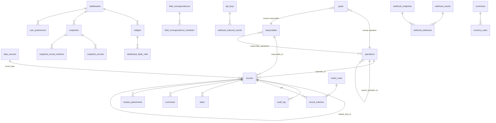

<!-- Versão: 1.2 | Data: 19/07/2026 -->

# Banco de dados — schema consolidado

Referência do estado **atual** do banco (após a migração 0077), para que um
mantenedor não precise ler as 78 migrações em ordem para reconstruir o modelo.
Complementa o runbook de aplicação em [`../supabase/README.md`](../supabase/README.md)
e a visão de fluxos em [`arquitetura.md`](./arquitetura.md).

> Ao alterar o schema, atualize este documento na mesma entrega — ele só é útil
> enquanto refletir o banco real.

## 1. Como o banco é gerido

- **Aplicação manual** no SQL Editor do Supabase; o código do app nunca conecta ao
  banco em build. Não há `supabase migration` automatizado nem CI.
- Migrações em `supabase/migrations/`, todas **idempotentes**. Blocos consolidados
  por fase em `supabase/apply/fase-*.sql` (também idempotentes) + scripts de
  agendamento `pg-cron-*.sql` e o `undo-mock-reuniao.sql`.
- **Anomalias de numeração** (não "corrija" — a ordem de aplicação real é a dos
  blocos `apply/fase-*.sql` e do runbook, não estritamente o número):
  - `0014` **não existe** (número pulado);
  - `0017` tem **dois arquivos** (`0017_dynamic_columns_and_formulas.sql` e
    `0017_widget_filter_type.sql`);
  - `0049` tem **dois arquivos** (`0049_field_percent.sql` e
    `0049_widget_rpc_count_nonempty.sql`).
- Extensões usadas: `pg_cron` e `pg_net` (agendamento), além das padrões do Supabase.

## 2. Visão geral do modelo

Papéis/permissões (`roles`, `permissions`, `role_permissions`, `user_roles`) ligam-se
a `auth.users` do Supabase, assim como `responsibles.user_id` (o vínculo que governa a
visibilidade — ver §6).

## 3. Tabelas por domínio

A coluna "Origem" indica a migração que criou a tabela; colunas adicionadas depois
citam a migração entre parênteses.

### 3.1 Núcleo de dados

**`records`** (0004) — fonte de verdade da UI. Um registro = um lead, negócio, venda
do site ou linha de fonte dinâmica.

| Coluna | Notas |
|---|---|
| `id` uuid PK | |
| `record_type` text | FK → `data_sources.record_type` desde 0060 (antes CHECK fixo `lead/negocio/venda_site`) |
| `source_system` text | `bitrix`, `sheet_site`, `manual`, `csv`... (CHECK vira regex na 0060) |
| `source_id` text | ID na origem; único por `(source_system, source_id)` |
| `owner_user_id` uuid | **LEGADO** — não usar para autorização (0037) |
| `title`, `pipeline`, `stage`, `stage_semantic`, `temperature` | `stage_semantic`: open/won/lose; `temperature` é campo local, nunca sincronizado |
| `value`, `mrr` numeric, `currency` text | |
| `sale_type`, `channel` text | |
| `closed` bool, `closed_at`, `opened_at` | |
| `source_created_at`, `source_modified_at` | DATE_CREATE/DATE_MODIFY na origem; `source_created_at` é o sort/período padrão (índices na 0069) |
| `custom_fields` jsonb | Todos os campos dinâmicos, inclusive calculados materializados |
| `field_modified_at` jsonb | `{campo: timestamp}` das edições manuais — protege do sync (conflito por campo) |
| `created_at`, `updated_at`, `last_synced_at`, `locally_modified_at` | |
| `responsible_id`, `operation_id`, `related_lead_id` uuid, `lead_time_days` numeric | (0012) |
| `is_mock` bool | (0051) — mocks de Data Reunião; ver invariantes em `arquitetura.md` §5 |

**`data_sources`** (0060) — catálogo de fontes (dinâmicas, criáveis via UI).
`key` PK (regex `^[a-z][a-z0-9_]{1,39}$`), `record_type` unique (fontes novas:
key === record_type), `label`, `short_label`, `default_period_field` (CHECK entre as
colunas de data do núcleo), `builtin`, `manual_entry` (0061 — aceita criação manual;
builtins nascem desligados). Seed dos 3 builtins: `leads/lead`, `deals/negocio`
(período `closed_at`), `estudo/venda_site`.

**`field_definitions`** (0005) — metadados das colunas dinâmicas.
`field_key` unique, `label`, `data_type` (`texto|numero|data|selecao|moeda` +
`calculado`/`calculado_agg` via 0017/0045), `options`, `visible_to_roles`,
`editable_by_roles`, `is_local`, `sort_order`. Adicionadas:
`source_system`/`source_field_id`/`show_in_builder`/`formula` (0017),
`applies_to` text[] (0018), `write_back` (0031), `currency_code`/`currency_mode`
(0036; `inherit` na 0046), `allow_negative` (0044), `show_as_percent` (0049).
Leitura liberada a autenticados desde 0043 (só metadados de schema).

**`field_correspondences`** + **`field_correspondence_members`** (0019) — campos
unificados globais: uma correspondência (`key` unique, `label`, `data_type`) liga no
máximo um `field_ref` por `record_type` (coluna do núcleo ou `custom:<key>`). O RPC
consome como `unified:<key>` (coalesce).

**`entity_custom_values`** (0033) — valores de campos dinâmicos anexados a
responsável/operação (não a um registro): `(entity_type, entity_id, field_key)` unique.

**`audit_log`** (0006) — toda edição de valor: `record_id`, `user_id` (null quando
via sync), `field`, `old_value`/`new_value` jsonb, `origin`
(`app|sync_bitrix|sync_sheet` + `api` desde 0074).

**`reuniao_freeze_backup`** (0051) — valores originais de Data Reunião zerados pela
Fase 12 (usado pelo `undo-mock-reuniao.sql`).

### 3.2 Pessoas e acesso

**`roles`**, **`permissions`**, **`role_permissions`**, **`user_roles`** (0002 + seeds
0010) — papéis `admin`/`gestor`/`vendedor` e permissões (`view_all_records`,
`edit_record_values`, `manage_field_definitions`, `view_forecast`, ...).

**`responsibles`** (0012) — lista curada de responsáveis. `display_name`,
`bitrix_user_id` unique (ASSIGNED_BY_ID, para o matching do sync), `user_id` →
`auth.users` (**o vínculo que dá visibilidade RLS ao vendedor**), `active`.

**`operations`** (0012) — operações comerciais; `parent_operation_id` (0016) permite
aninhamento (subárvore via função `operation_subtree`).

**`responsible_operations`** (0012) — N:N com `priority` (1 = operação primária).

**`bitrix_user_map`** (0007) — mapeia usuário Bitrix → `auth.users`.

**`user_preferences`** (0024) — por usuário × dashboard (ex.: último período usado).
**`user_settings`** (0027) — jsonb livre por usuário (layout/aparência).

### 3.3 Dashboards e visualização

**`dashboards`** (0008) — `name`, `owner_user_id`, `visible_to_roles` text[],
`is_shared`, `settings` jsonb (0017 — barra de período etc.), `kind`
(`dashboard|kanban`, 0062).

**`widgets`** (0008) — config declarativa: `dashboard_id`, `title`, `visual_type`,
`source`, `dimensions`/`metrics`/`filters` jsonb, `grid_position` jsonb,
`sort_order`, `settings` jsonb (0016), `sources` jsonb + `split_by_source` (0021).
O CHECK de `visual_type` foi recriado várias vezes; conjunto atual (0073):
`tabela, barra, barra_horizontal, linha, pizza, kpi, funil, tabela_editavel,
calculado, filtro, filtro_campo, calculadora, nota, forma, kanban, agenda, imagem`.

**`dashboard_table_cells`** (0026) — células da "Tabela editável":
`(widget_id, row_key, col_key)` unique, `value` jsonb. Escrita liberada a qualquer
visualizador do dashboard (propositalmente mais amplo que `widgets_write`).

**`goals`** (0016) — metas: `period_year`, `period_month` (null = anual), `scope`
(`global|operation|responsible`) + alvo, `metric` livre (`mrr`, `clientes`...),
`target` numeric. Única por período/escopo/alvo/métrica. O roll-up é na leitura.

**`tasks`** (0063) — tarefas: vínculos opcionais a `record_id`/`board_id`, `phase`,
`due_date`/`due_time`, `completed_at/by`, `responsible_id` (mesma entidade dos
registros), `position` (ordenação fracionária), `locked` (trava: só admin/gestor).
Adicionadas na 0066: `parent_task_id` (subtarefas), `pinned`, `feed_position`,
`is_global`, `assigned_at`.

**`comments`** (0066) — feed dos cards: exatamente um pai (`record_id` XOR
`task_id`), `body`, `pinned`, `position`.

**`kanban_placements`** (0067) — posição de registros em kanbans com colunas
"Personalizar": exatamente um dono (`widget_id` XOR `board_id`) + `record_id`,
`column_key`, `position`.

### 3.4 Snapshots (acesso público congelado)

**`snapshots`** (0056) — metadados + config congelada: `dashboard_id`, `tab_id`,
`name`, `token_hash` (sha256 hex — o token em claro NUNCA é armazenado),
restrições `allowed_responsible_ids`/`allowed_operation_ids`/`allowed_sources`
(null = todos), `allow_quick_filters`/`allow_widget_filters`, agendamento
(`refresh_mode` `manual|hourly|daily|weekly`, `refresh_time`, `refresh_weekday`,
`next_refresh_at`), `status` (`active|paused`), `config` jsonb (bundle congelado —
shape em `lib/snapshots/types.ts`), `default_period` jsonb (0059), telemetria
(`last_refreshed_at`, `last_refresh_error`, `last_accessed_at`, `access_count`).

**`snapshot_records`** (0056) — cópia congelada dos registros permitidos
(PK `(snapshot_id, id)`; espelha as colunas consultáveis de `records`, incl.
`is_mock`). **`snapshot_record_matches`** (0056) — cópia dos matches.

### 3.5 Sync e integrações

**`sync_config`** (0007) — key-value jsonb de configuração.
**`bitrix_lookup_cache`** (0007) — labels de status/usuários/enums do Bitrix.

**`sync_jobs`** (0023) — estado resumível de backfill/reconcile: `kind`, `params`,
`status` (`running|done|error|canceled`), `plan` (fases), `phase_index`,
`bitrix_start` (offset de paginação), `phase_totals`, `processed_total`, `context`
(maps/enum persistidos uma vez), `totals` (SyncResult acumulado), `trigger`
(`manual|auto`, 0030).

**`bitrix_writeback_queue`** (0032) — fila de write-back: `record_id`, `entity`
(`deal|lead`), `source_id`, `field_key`, `source_field_id` (UF_CRM_*), `new_value`,
`status` (`pending|done|error`), `attempts`.

**`match_rules`** (0041) — regras de matching entre fontes: par de fontes + até 2
pares de campos (par 2 = fallback), `enabled`, `priority`.
**`record_matches`** (0041) — matches efetivos: `(record_a_id, record_b_id)` unique,
`mode` (`auto|manual`), `matched_on`. Índices compostos `(record_a_id, created_at desc)`
/ `(record_b_id, created_at desc)` (0077) assistem a subconsulta correlacionada de
`match:` (`_widget_match_expr`, 0042), que resolve o registro casado por linha.

**`currencies`** (0036) — moedas habilitáveis (seed: BRL/USD ligadas, EUR/GBP/ARS
desligadas). **`currency_rates`** (0036) — taxa R$ por unidade, PK
`(code, year, quarter)` com `quarter` 0 = anual, 1–4 = trimestral.

**`api_keys`** (0074) — chaves de ingestão: `key_hash` (sha256; nunca plaintext),
`key_prefix` (exibição), `label`, `source_key` → `data_sources`, `mapping` jsonb
(ColumnMapping[]), `dedup_columns`, `revoked_at`.

**`webhook_endpoints`** (0074) — destinos de saída: `url` (CHECK https),
`event_types` (vazio = todos), `secret_ciphertext` (AES-256-GCM via
`KEY_ENCRYPTION_KEY`), `active` + `disabled_reason` + `consecutive_failures`
(auto-desativação).

**`webhook_events`** (0074) — outbox de eventos; **`webhook_deliveries`** (0074) —
entregas por endpoint: `status` (`pending|delivered|dead`), `attempts`,
`next_attempt_at` (retry/backoff), `response_status`.

**`webhook_inbound_events`** (0074) — log de entrada: `api_key_id`,
`external_event_id` (dedup por índice único parcial), `kind` (`rows|event`),
`payload`, `status` (`received|processed|error`), `result`.

## 4. Funções

### 4.1 O par crítico de RPCs de widget

| Função | Versão vigente | Papel |
|---|---|---|
| `run_widget_query` | **0072** (recriada 17×: 0011, 0015, 0020, 0025, 0028, 0034, 0035, 0039, 0040, 0042, 0047, 0048, 0049, 0050, 0052, 0054, 0072) | Monta SQL dinâmico contra `records` a partir da config JSONB do widget |
| `run_widget_query_snapshot` | **0072** (0056, 0057, 0072) | Cópia apontada para `snapshot_records`, com restrições do snapshot aplicadas internamente (`is_mock OR restrições`); EXECUTE só para service role |

**Invariante:** toda migração que recriar `run_widget_query` DEVE recriar
`run_widget_query_snapshot` (e `_widget_match_expr` ↔ `_widget_match_expr_snap`) no
mesmo arquivo. Ver `arquitetura.md` §5.

Helpers da família (todos `_widget_*`): `_widget_col_expr`, `_widget_unified_expr`,
`_widget_col_date_expr`, `_widget_unified_date_expr`, `_widget_safe_ts`,
`_widget_norm_text`, `_widget_safe_numeric`, `_widget_match_expr`(`_snap`),
`_widget_wrap_record_types`.

### 4.2 Demais funções

| Função | Origem | Papel |
|---|---|---|
| `set_updated_at` | 0001 | Trigger genérico de `updated_at` (usado por ~28 tabelas) |
| `auth_roles`, `auth_has_role`, `auth_has_permission` | 0003 | Helpers de RLS (SECURITY DEFINER); desde 0068, sempre chamados como `(select ...)` nas policies |
| `auth_responsible_ids` | 0037 | IDs de `responsibles` vinculados ao usuário logado — base da visibilidade do vendedor |
| `operation_subtree` | 0016 | Subárvore de operações (aninhamento) |
| `snapshot_refresh_copy` | 0056 (recriada 0057) | Cópia atômica de `records` → `snapshot_records` (mock-aware); EXECUTE só service role |
| `enforce_reuniao_freeze` | 0051 | Trigger: descarta escrita de Data Reunião < 01/06/2026 e protege mocks |
| `enforce_task_lock` | 0063 | Trigger: só admin/gestor excluem/destravam tarefa `locked` |
| `enforce_task_global` | 0066 | Trigger: só admin/gestor alteram tarefas globais |
| `recalc_apply_updates` | 0070 | Aplica um lote de recálculo num único UPDATE set-based |

## 5. Triggers

- **`trg_*_updated_at`** em ~28 tabelas → `set_updated_at` (padrão da 0001).
- **`trg_records_reuniao_freeze`** (0051) em `records` → `enforce_reuniao_freeze`.
- **`trg_tasks_lock`** (0063) e **`trg_tasks_global`** (0066) em `tasks`.

## 6. RLS — resumo do modelo

- **`records`**: vendedor vê apenas registros cujo `responsible_id` aponta para uma
  linha de `responsibles` com `user_id` = ele (via `auth_responsible_ids`); quem tem
  `view_all_records` (admin/gestor) vê tudo. INSERT: admin, ou `edit_record_values`
  para registros manuais em fontes com `manual_entry` (0061; ramo Bitrix-espelho na
  0065). `owner_user_id` NÃO é critério (0037).
- **`dashboards`/`widgets`**: dono ou admin escrevem; visibilidade por
  `visible_to_roles`/`is_shared`. `dashboard_table_cells`: qualquer visualizador
  do dashboard escreve (por design).
- **`snapshots`/`snapshot_*`**: gestão só `authenticated` (dono do dashboard ou
  admin); **NENHUMA política `anon`**; escrita das cópias e EXECUTE das funções de
  snapshot só via service role.
- **Tabelas de configuração** (`field_definitions`, `currencies`, `match_rules`,
  correspondências...): leitura para autenticados; escrita exige
  `manage_field_definitions`.
- **Tabelas de segredo/operacão** (`api_keys`, `webhook_*`, `sync_jobs`,
  `bitrix_writeback_queue`): SELECT admin (ou `view_all_records`/autenticado nos
  casos do 0038); escrita SÓ service role (`revoke` explícito na 0074).
- **Performance**: helpers nas policies sempre como `(select ...)` — InitPlan (0068).

Queries de verificação pós-migração (políticas `anon`, EXECUTE das funções de
snapshot): ver [`../supabase/README.md`](../supabase/README.md).

## 7. Histórico de migrações (0001–0077)

| Nº | Arquivo | O que faz |
|---|---|---|
| 0001 | extensions_utils | Extensões e `set_updated_at` |
| 0002 | roles_permissions | Papéis, permissões e vínculos |
| 0003 | rls_helpers | `auth_roles`/`auth_has_role`/`auth_has_permission` |
| 0004 | core_records | Tabela `records` |
| 0005 | field_definitions | Colunas dinâmicas |
| 0006 | audit_log | Auditoria de edições |
| 0007 | mappings_sync_config | `bitrix_user_map`, `bitrix_lookup_cache`, `sync_config` |
| 0008 | dashboards_widgets | `dashboards` + `widgets` |
| 0009 | rls_policies | Políticas RLS da fundação |
| 0010 | seeds | Seeds de papéis/permissões/sync |
| 0011 | widget_rpc | Primeira `run_widget_query` |
| 0012 | responsaveis_operacoes | `responsibles`, `operations`, N:N, colunas em `records` |
| 0013 | lead_email_index | Índice funcional de e-mail (lead relacionado) |
| 0014 | — | **Não existe** (número pulado) |
| 0015 | widget_rpc_extend | RPC: responsible/operation/related_lead/lead_time |
| 0016 | metas_operacoes | `goals`, aninhamento de operações, `widgets.settings`, `operation_subtree` |
| 0017 | dynamic_columns_and_formulas | Colunas do Bitrix + campos calculados (**duplicado**) |
| 0017 | widget_filter_type | Widget "filtro de período" + `dashboards.settings` (**duplicado**) |
| 0018 | field_applies_to | `field_definitions.applies_to` |
| 0019 | field_correspondences | Correspondências globais (campos unificados) |
| 0020 | widget_rpc_sources | RPC: campos `unified:<key>` |
| 0021 | widget_sources | `widgets.sources` + `split_by_source` |
| 0022 | field_label_overrides | Rótulos visuais autoritativos + visibilidade |
| 0023 | sync_jobs | Sync incremental/retomável |
| 0024 | user_preferences | Preferências por usuário × dashboard |
| 0025 | widget_rpc_title | RPC: expõe `records.title` |
| 0026 | dashboard_table_cells | Widget "Tabela editável" |
| 0027 | user_settings | Settings por usuário + visual_type `barra_horizontal` |
| 0028 | widget_rpc_ilike | RPC: operador `ilike` |
| 0029 | widget_field_filter_type | Widget "Filtro por campo" |
| 0030 | sync_jobs_trigger | Sync automático horário (`sync_jobs.trigger`) |
| 0031 | field_definitions_write_back | Flag `write_back` |
| 0032 | bitrix_writeback_queue | Fila de write-back |
| 0033 | entity_custom_values | Campos dinâmicos de responsável/operação |
| 0034 | widget_rpc_date_buckets | RPC: transforms month_name/month_year/... |
| 0035 | widget_rpc_weekday | RPC: transform weekday |
| 0036 | currencies | Moedas + taxas ano/trimestre |
| 0037 | visibility_by_responsible | `auth_responsible_ids`; visibilidade pelo vínculo vivo |
| 0038 | config_read_access | Configurações para gestor/vendedor |
| 0039 | widget_rpc_rate_date | RPC: dimensão sintética `@rate_date` |
| 0040 | widget_rpc_period | RPC: filtro sintético `@period` |
| 0041 | record_matches | `match_rules` + `record_matches` |
| 0042 | widget_rpc_match | RPC: campos do registro casado; `_widget_match_expr` |
| 0043 | field_definitions_metadata_readable | Leitura de metadados para todos |
| 0044 | field_definitions_allow_negative | Flag `allow_negative` |
| 0045 | field_definitions_calculado_agg | Tipo `calculado_agg` |
| 0046 | moeda_inherit | `currency_mode='inherit'` |
| 0047 | widget_rpc_period_custom | RPC: período por fonte/campos custom de data |
| 0048 | widget_rpc_bucket_filter | RPC: filtros rápidos por widget |
| 0049 | field_percent | Flag `show_as_percent` (**duplicado**) |
| 0049 | widget_rpc_count_nonempty | RPC: contagem ignora strings vazias (**duplicado**) |
| 0050 | widget_rpc_normalized_cond | RPC: operadores normalizados (eq_ci etc.) |
| 0051 | mock_data_reuniao | Fase 12: mocks + congelamento + backup |
| 0052 | widget_rpc_mock_rule | RPC: regra dos mocks |
| 0053 | mock_operacoes | Fase 13: operação nos mocks (+32 Outbound) |
| 0054 | widget_rpc_filter_sources | RPC: filtros segmentados por fonte |
| 0055 | widget_calc_note_shape_types | visual_type calculadora/nota/forma |
| 0056 | snapshots | Snapshots + RPC gêmea + `snapshot_refresh_copy` |
| 0057 | snapshots_mock_rule | Mocks entram sempre no dataset congelado |
| 0058 | mock_responsible_user_link | Mocks re-apontados ao responsável com `user_id` |
| 0059 | snapshot_default_period | `snapshots.default_period` |
| 0060 | data_sources | Fontes dinâmicas (catálogo) |
| 0061 | manual_records | `manual_entry` + policy de INSERT manual |
| 0062 | dashboards_kind | `dashboards.kind` (kanban) |
| 0063 | tasks | Tarefas + trava `locked` |
| 0064 | widget_kanban_agenda_types | visual_type kanban/agenda |
| 0065 | manual_records_bitrix | Criação manual com espelho no Bitrix |
| 0066 | comments_subtasks_global | Feed (comments), subtarefas, tarefas globais |
| 0067 | kanban_placements | Colunas "Personalizar" do kanban |
| 0068 | rls_initplan | Performance: helpers como InitPlan |
| 0069 | records_indexes | Performance: índices de `records` |
| 0070 | recalc_batch | Performance: `recalc_apply_updates` |
| 0071 | realtime_publication | Realtime em records/tasks/comments |
| 0072 | widget_rpc_min_max | RPC (par completo): agregações min/max — **versão vigente** |
| 0073 | widget_image_type | visual_type `imagem` |
| 0074 | webhooks | api_keys, endpoints, outbox, log de entrada; `audit_log.origin='api'` |
| 0075 | fonte_implementacao_bitrix | `fonte` (SOURCE_ID) curada + `implementacao` vira campo Bitrix (UF_CRM_1778094396888) |
| 0076 | moved_time_visivel | Reconcilia `bitrix_moved_time` (MOVED_TIME) em field_definitions: chave canônica + visível (par do bitrix-field-map v1.4) |
| 0077 | record_matches_match_perf | Performance: índices compostos `(record_a/b_id, created_at)` p/ a subconsulta `match:` (`_widget_match_expr`) |
